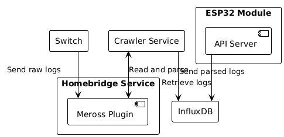

# meross-logger


[](https://github.com/vshymanskyy/StandWithUkraine/blob/main/docs/README.md)

## General Information

Services used to log statuses of deployed Meross devices, providing access to data using **ESP32** device.

Includes following features:
* Retrieve statuses of **Meross** devices using Homebridge plugin.
* Save retrieved data to **InfluxDB** storage
* Provide access to saved data via **REST API** exposed via **ESP32** device.



## Setup

All supportive setup related operations are processed via **Makefile** placed in the root of each service.

### Crawler

To start crawler service, the following command should be used:

```bash
make start
```

### Server

To build and upload server service, the following command should be used:

```bash
make build
```